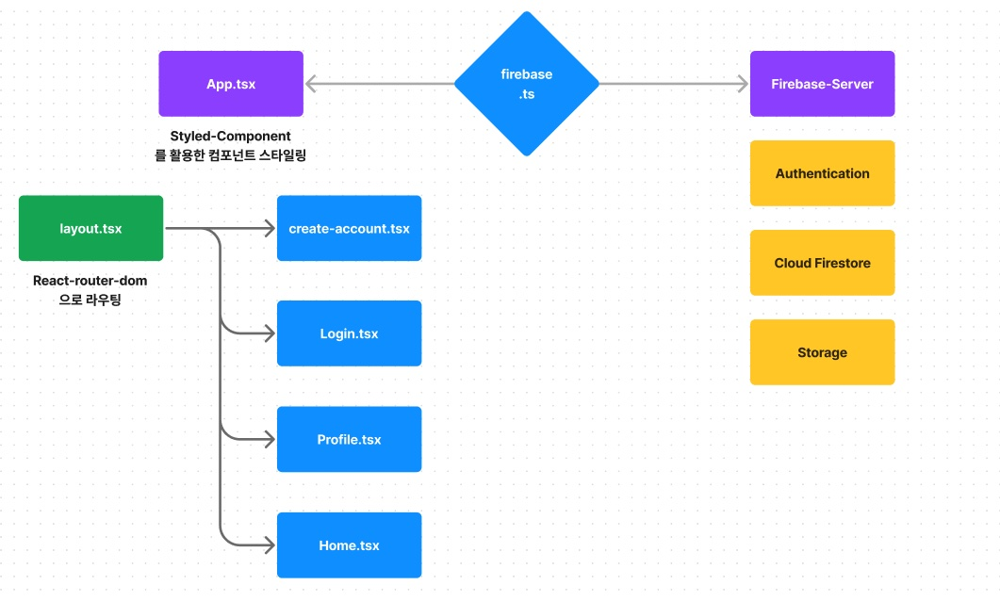

# 트윗 프로젝트(Tweet)

배포 링크 : https://monumental-cranachan-e1e7d3.netlify.app/

## 프로젝트 개요 및 학습목적
* 본 프로젝트는 노마드코더님의 firebase, React-typescript, Vite를 활용한 트위터 클론 프로젝트를 참조했습니다.

- 서버를 직접 구성, 구현하지 않고 서버 기능을 제공하는 서비스를 활용하는 경험 (Firebase 활용)
- 기능별 컴포넌트의 세분화 및 관리 경험


## 프로젝트 아키텍쳐



## 목차
- [1. firebase의 Authentication, Cloud Firebase, Firestore 간단 정리](#1-firebase의-authentication-cloud-firebase-firestore-간단-정리)
- [2. firebase.ts로 프로젝트 config 설정](#2-firebasets로-프로젝트-config-설정)
- [3. Routing 설정](#3-routing-설정)
- [4. 게시물 생성 및 저장](#4-게시물-생성-및-저장)
- [5. 게시물 수정](#5-게시물-수정)
- [6. 해결중인 문제](#6-해결중인-issue)
- [7. 빌드 & 배포 & 의존성 & Dev 실행 명령어](#7-빌드--배포--의존성--dev-실행-명령어)

## 내용
### 1. firebase의 Authentication, Cloud Firebase, Firestore 간단 정리

Firebase는 구글에서 제공하는 서비스형 백엔드(BaaS)이다. Firebase에서 제공하는 서비스는 크게 빌드, 출시 및 모니터링, 참여로 나뉘는데 본 프로젝트에서는 웹을 제작하는데 사용되는 인증, db, storage만을 사용하기에 빌드부분만을 다뤘다.

Firebase Auth는 Firebase Auth Rest API 형식으로 클라이언트와 서버 간에 인증작업을 실행한다. 이를 활용해 사용자 생성, 로그인 등의 작업을 할 수 있다.

기본적으로 인증은 아래와 같은 샘플 요청 및 응답으로 진행되지만, 참조문서에는 다양한 방식으로 쿼리를 구성할 수 있다고 제시되어 있다.
[Firebase 인증 REST API](https://firebase.google.com/docs/reference/rest/auth?hl=ko)
```bash
* 샘플요청
curl 'https://identitytoolkit.googleapis.com/v1/accounts:signInWithPassword?key=[API_KEY]' \
-H 'Content-Type: application/json' \
--data-binary '{"email":"[user@example.com]","password":"[PASSWORD]","returnSecureToken":true}'
```
```javascript
{
  "localId": "ZY1rJK0eYLg...",
  "email": "[user@example.com]",
  "displayName": "",
  "idToken": "[ID_TOKEN]",
  "registered": true,
  "refreshToken": "[REFRESH_TOKEN]",
  "expiresIn": "3600"
}
```

Firebase의 db는 다시 Cloud Firestore와 Storage로 나뉜다.

Firebase는 비관계형 데이테베이스(NoSQL)을 기반으로 하며, 관계형 데이터베이스의 행과열, 테이블을 사용하지 않고 모든 데이터를 키-쌍 값, json과 같은 문서, 그래프 등의 다양한 데이터 모델을 활용하여 데이터를 저장한다.

Firestore는 클라이언트에서 생성된 문서를 컬렉션(디렉토리)에 저장하고, 요청에 따라 업데이트한다. 또한 인덱싱을 활용해 복잡한 쿼리를 빠르게 처리할 수 있다.
[firebase 데이터 구조 선택](https://firebase.google.com/docs/firestore/manage-data/structure-data?hl=ko)

*핵심 : 클라이언트에서 서버리스 프로젝트를 진행할 때, 별도의 node.js 쿼리 처리 로직 없이 firebase 콘솔에서 제공하는 GUI 형태의 인덱싱을 가지고 쉽게 쿼리를 구현할 수 있다는 점!

Storage는 Google Cloud Storage를 기반으로 하는 파일 저장 서비스이다. 사용자가 생성한 각종 컨텐츠(이미지, 비디오, 오디오 등)를 저장하기에 적합하며 Firebase SDK를 활용해 간편하게 파일을 업로드할 수 있다.
[storage 시작하기](https://firebase.google.com/docs/storage/web/start?hl=ko)

### 2. firebase.ts로 프로젝트 config 설정
```javascript
import { initializeApp } from "firebase/app";
import { getAuth } from "firebase/auth";
import { getFirestore } from "firebase/firestore";
import { getStorage } from "firebase/storage";
// TODO: Add SDKs for Firebase products that you want to use

// Firebase 콘솔에서 프로젝트 생성 시, 프로젝트 초기화 Config 제공 => 복붙!
// .env 파일로 안전하게 보관
const firebaseConfig = {
  apiKey: import.meta.env.VITE_API_KEY,
  authDomain: import.meta.env.VITE_AUTH_DOMAIN,
  projectId: import.meta.env.VITE_PROJECT_ID,
  storageBucket: import.meta.env.VITE_STORAGE_BUCKET,
  messagingSenderId: import.meta.env.VITE_MESSAGING_SENDER_ID,
  appId: import.meta.env.VITE_APP_ID,
  measurementId: import.meta.env.VITE_MEASUREMENT_ID,
};

// Initialize Firebase
// 초기화된 나의 앱이 App이라는 변수명에 포함되어 있음
const app = initializeApp(firebaseConfig);
export const auth = getAuth(app); // Firebase에서 제공하는 getAuth()메서드를 통해 앱의 인증정보 호출 후 auth 변수에 보관
export const storage = getStorage(app); // Firebase에서 제공하는 getStorage()메서드를 통해 앱의 storage 참조(ref)주소를 보관
export const db = getFirestore(app); // Firebase에서 제공하는 getStorage()메서드를 통해 앱의 cloudfirestore 참조(ref)주소를 보관
```

### 3. Routing 설정
- 관련 파일 : [App.tsx](./src/App.tsx)
```javascript
// 라우팅하고자 하는 컴포넌트를 Layout에 담고, BrowserRouter 객체에 담아 RouterProvier에 전달
    <Wrapper>
      <GlobalStyles />
      {isLoading ? <LoadingScreen /> : <RouterProvider router={router} />}
    </Wrapper>

// 이후 createBrowserRouter를 활용해 객체 형식으로 Routing 관리
const router = createBrowserRouter([
  {
    path: "/",
    element: (
      <ProtectedRoute>
        <Layout />
      </ProtectedRoute>
    ),
    children: [
      {
        path: "",
        element: <Home />,
      },
      ...
    ],
  },
  {
    path: "/login",
    element: <Login />,
  },
   ...
]);
```

### 4. 게시물 생성 및 저장
- 관련 파일 : [post-tweet-form.tsx](./src/components/post-tweet-form.tsx)
```javascript
const onSubmit = async (e: React.FormEvent<HTMLFormElement>) => {
    e.preventDefault();
    const user = auth.currentUser;
    if (!user || isLoading || tweet === "" || tweet.length > 200) return;
    try {
      setIsLoading(true);
      const doc = await addDoc(collection(db, "tweets"), {
         // addDoc = doc 생성 메서드,
         // collection은 db에 저장되는 디렉토리 형식의 필드,
         // 인자로 전달되는 내용은 firestore.ts에서 정의한 db 주소와 쿼리 주소
        tweet,
        createdAt: Date.now(),
        username: user.displayName || "Anonymous",
        userId: user.uid,
      });
      // 생성될 문서의 데이터 형식 (키-쌍)
      if (file && file.size < 1024*1024) {
        const locationRef = ref(
          storage,
          `tweets/${user.uid}${doc.id}`
        );
        // form에서 첨부된 파일은 ref() 메서드를 통해 storage에 저장
        // 인자로 전달되는 내용은 firestore.ts에서 정의한 storage 주소와 쿼리(실제 파일 주소 혹은 파일id로 저장됨)
        const result = await uploadBytes(locationRef, file);
        const url = await getDownloadURL(result.ref);
        // storage url을 전달받아서 url 변수에 저장
        await updateDoc(doc, {
          photo: url,
        });
        // db 문서를 업데이트
      }
```

### 5. 게시물 수정
- 관련 파일 : [tweet.tsx](./src/components/tweet.tsx)
```javascript
  const saveEditTweet = async () => {
    if (!user || tweet === newTweet) setEdit(!edit); // 이전 트윗과 동일할 경우 변경하지 않고, edit 종료
    try {
      await updateDoc(doc(db, "tweets", id), {
        tweet: newTweet,
      });
      // 트윗을 업로드할 경우, 사용자의 게시물의 id, 쿼리, db 참조를 활용하여 접근
      // 사용자 일치여부는 클라이언트에서 점검
    } catch (e) {
      console.log(e);
    } finally {
      setEdit(!edit);
    }
  };
```

### 6. 해결중인 Issue
- 관련 파일 : [tweet.tsx](./src/components/tweet.tsx)
```javascript
  const editPhoto = async (e: React.ChangeEvent<HTMLInputElement>) => {
    e.stopPropagation() // 이벤트버블링을 막았는데도?
    console.log(id)
    // input을 실행시키지 않았을 때는, 정상적으로 컴포넌트의 id가 console에 출력되는데,
    // input을 실행시키면 상위 컴포넌트에서 서버로부터 받아온 data의 0번째 인덱스가 id에 할당되어서 쿼리가 가장 최근에 post한 id가 됨
    // 이로 인해 다른 컴포넌트에서 업로드 한 이미지가 0번째로 받아온 트윗의 이미지에 적용되어버리는 에러 발생
    // TODO : 이벤트 버블링에 의한 에러로 추측하고 해결 중에 있음
    const { files } = e.target;
    const ok = confirm("정말로 트윗의 이미지를 수정하시겠습니까?");
    if (!ok || !user || files === null) return;
    const file = files[0];
    const locationRef = ref(storage, `tweets/${user.uid}${id}`);
    const result = await uploadBytes(locationRef, file);
    const tweetPhotoUrl = await getDownloadURL(result.ref);
    setTweetPhoto(tweetPhotoUrl);
    await updateDoc(doc(db, "tweets", id), {
      photo: tweetPhotoUrl,
    });
  };
```

### 7. 빌드 & 배포 & 의존성 & Dev 실행 명령어
- 빌드 : Vite @4.4.5, Typescript @5.0.2, React @18.2.0, swc @3.3.2
- 배포 : Netlify
- 의존성 : firebase @10.5.2, react-router-dom @6.14.2, styled-components @6.0.7
- dev 실행명령어 : ```npm run dev```